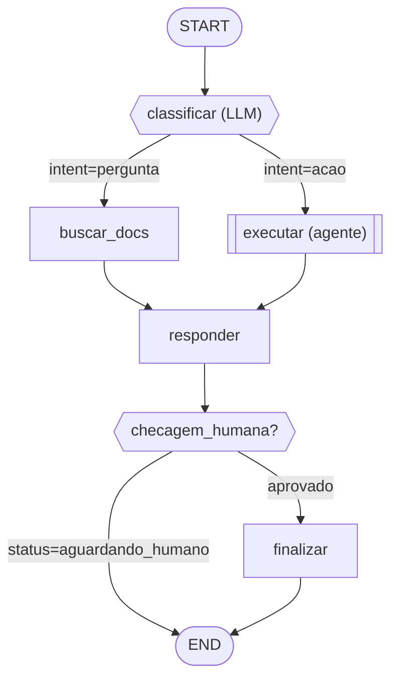

# Rascunho de Fluxo LangGraph — {NOME DO FLUXO}

## 1. Resumo do fluxo

{2-3 frases: objetivo, entrada, saída/END, padrão dominante e quaisquer sub-padrões internos.}

## 2. Diagrama

Convenção:
- `["nome"]` retângulo = node **DET** (`add_edge`).
- `{{"nome"}}` losango = node **NÃO-DET roteado** (`Command[Literal]`), com arestas rotuladas pela condição.
- `[["nome (agente)"]]` subrotina = **agent-as-node** (loop de tools encapsulado).
- Aresta para `END` rotulada `status=aguardando_humano` = ponto de **State-Check / HITL**.

## 3. Schema do State (Regra CRUE)

Apenas dados brutos. Prompts são montados dentro dos nodes.

| Campo | Tipo | Descrição |
|---|---|---|
| `status` | `str` | Flag de roteamento. Valores: `...`, `aguardando_humano`, `concluido`. |
| `mensagens` | `list` | Histórico bruto. Sumarizar a cada N mensagens. |
| `...` | `...` | ... |

**Derivado (NÃO armazenar):** {liste o que é computado on-demand.}

## 4. Tabela de nodes

| Node | Tipo | Determinismo | Mecanismo de aresta | Responsabilidade |
|---|---|---|---|---|
| `classificar` | LLM | NÃO-DET roteado | `Command[Literal["buscar","executar"]]` | Classifica o intent e escolhe o ramo. |
| `buscar_docs` | Data | DET | `add_edge → responder` | Recupera docs relevantes. |
| `executar` | Agent | NÃO-DET agente | `add_edge → responder` | Loop de tool-calling para executar a ação. |
| `responder` | LLM | DET | `add_edge → review` | Gera a resposta a partir dos dados crus. |
| `review` | Router | NÃO-DET roteado | `Command[Literal["finalizar","__end__"]]` | State-Check: precisa de humano? |
| `finalizar` | Action | DET | `add_edge → END` | Encerra e persiste. |

## 5. Explicação de cada node

### `classificar` (LLM, NÃO-DET roteado)
Lê `mensagens` do state. Monta o prompt de classificação on-demand. Decide entre os destinos `buscar` (pergunta) e `executar` (ação) e retorna `Command(update={"status": ...}, goto=...)`. **Por que não-determinístico:** o destino depende do conteúdo da mensagem, conhecido só em runtime.

### `executar` (agent-as-node, NÃO-DET agente)
{...o que lê, o que faz, quais tools, o que retorna. Por que é agente e não nodes explícitos.}

{... um parágrafo por node ...}

## Decisões em aberto / riscos

- {Ambiguidade que sobrou ou trade-off a revisitar.}
- {Ex.: granularidade de `responder` — separar geração de pós-processamento? Estratégia de sumarização de `mensagens` ainda indefinida.}
