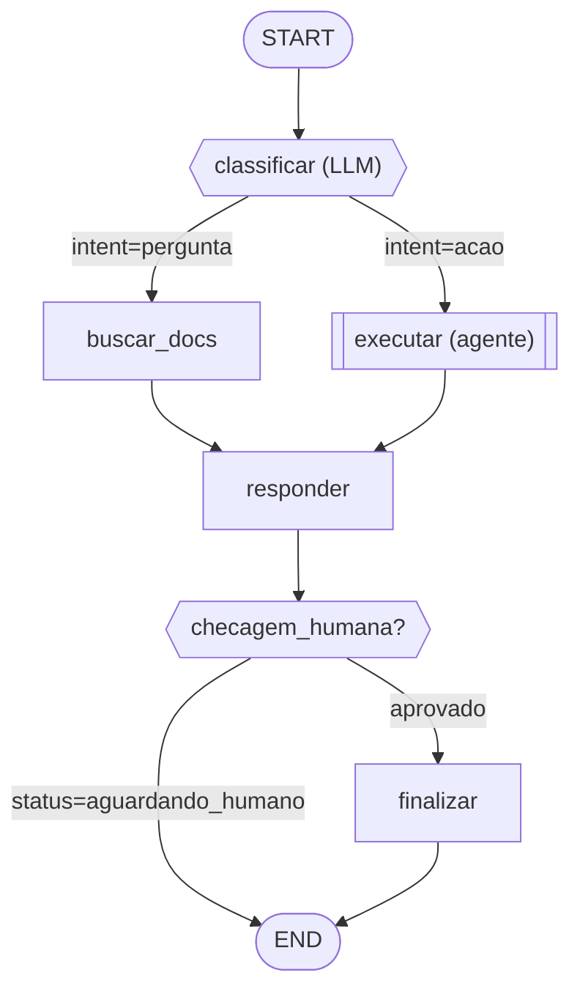

# Parecer e Rascunho LangGraph — {NOME DO FLUXO}

## 0. Parecer de adequação

- **Veredito:** `LANGGRAPH JUSTIFICADO` | `USO PARCIAL`
- **Razão estrutural:** {loop LLM→tools→LLM / workflow adaptativo / estado retomável}
- **Alternativa mínima considerada:** {worker, serviço, fila, cron...}
- **Fora do LangGraph:** {hot paths, transações, locks, captura, scheduling...}
- **Fronteira/contrato:** {evento/entrada, dados, idempotency key, dono da transação, SLA}

## 1. Resumo do fluxo

{Objetivo, entrada, saída/END e padrão dominante.}

## 2. Diagrama

Convenção: `["nome"]` = DET; `{{"nome"}}` = roteado; `[["nome (agente)"]]` = agent-as-node; State-Check/HITL vai para END.

## 3. Schema do State (CRUE)

| Campo | Tipo | Descrição |
|---|---|---|
| `status` | `str` | Flag de roteamento. |
| `mensagens` | `list` | Histórico bruto; estratégia de sumarização definida. |
| `...` | `...` | ... |

**Derivado (não armazenar):** {itens calculados on-demand.}

## 4. Tabela de nodes

| Node | Tipo | Determinismo | Aresta | Responsabilidade |
|---|---|---|---|---|
| `...` | `...` | `...` | `...` | `...` |

## 5. Explicação de cada node

### `{node}`

{O que lê, faz, retorna e por que a transição é fixa/roteada/agente.}

## Decisões em aberto / riscos

- {risco ou trade-off}
