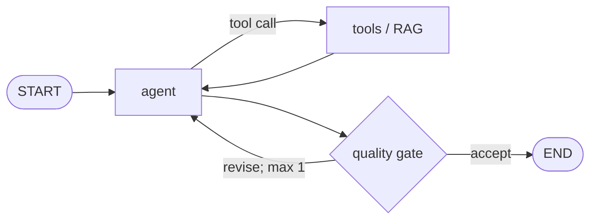

# LANGGRAPH-ARCHITECTURE-PLAN.md — exemplo mínimo

## Status e escopo
`READY` — chatbot de suporte documental; sem ações mutáveis.

## Evidências do estado atual
- `src/graph.py:20`: grafo atual possui apenas geração direta.
- `src/prompts.py:4`: prompt estático sem domínio ou preferência do usuário.

## Requisitos e restrições
- Resposta fundamentada em documentação interna.
- P95 e orçamento devem ser medidos; nenhum valor foi presumido.

## Arquitetura proposta

## State schema e reducers
`messages`, `retrieved_documents`, `answer`, `quality`, `attempts`; reducers e ownership definidos no plano real.

## Tabela de nodes e edges
| Node | Responsabilidade | Saídas |
|---|---|---|
| agent | gerar ou solicitar tool | messages, answer |
| tools | recuperar evidência | retrieved_documents |
| quality_gate | validar grounding e intenção | quality, route |

## Contexto, memória e grounding
Checkpointer por `thread_id`, Store por `user_id`, sumarização por tokens e RAG 2-Step para perguntas documentais.

## Tools, permissões e side effects
Retrieval read-only; descrição, schema, timeout e erro explícitos.

## Quality gate, retries, HITL e limites
Uma revisão máxima; sem evidência suficiente, responder “não sei” ou pedir contexto.

## Observabilidade e evals
Runs/traces/threads; resposta final, trajetória e node; 5–10 exemplos curados por componente crítico.

## Plano incremental de implementação
1. Estado e persistência.
2. Retrieval e contexto dinâmico.
3. Quality gate e limites.
4. Evals e rollout.

## Matriz requisito → mudança → teste/evidência
| Requisito | Mudança | Teste/evidência |
|---|---|---|
| grounding | retrieval + citações | groundedness + retrieval relevance |

## Riscos, decisões e perguntas abertas
Medições de latência e corpus continuam abertas até execução real.
